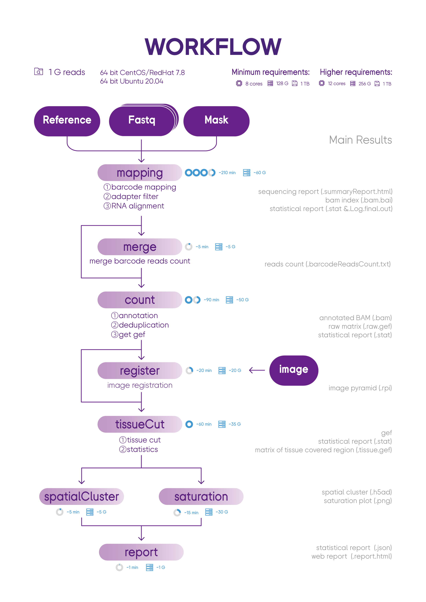

# SAW : STOmics Analysis Workflow
Workflow for analyzing Stereo-Seq transcriptome data
STOmics Analysis Workflow1 (SAW) software suite is a set of pipelines bundled to position sequenced reads
to their spatial location on the tissue section, quantify spatial gene expression and visually present spatial
expression distribution. 

##  Introduction
SAW processes the sequencing data of Stereo-Seq to generate spatial gene expression
matrices, and then users could take these files as the starting point to perform downstream analysis. SAW
includes eight essential pipelines: 


##  System Requirements
###   Hardware
STOmics Analysis Workflow (SAW) run on Linux systems that meet these minimum requirements:
* 8-core Intel or AMD processor (24 cores recommended)
* 128GB RAM (256GB recommended)
* 1TB free disk space
* 64-bit CentOS/RedHat 7.8 or Ubuntu 20.04

###   Software
* Singularity : a container platform
* SAW in the Singularity Image File (SIF) format

####   Quick installation of Singularity
```
On Red Hat Enterprise Linux or CentOS install the following dependencies:
$ sudo yum update -y && \
     sudo yum groupinstall -y 'Development Tools' && \
     sudo yum install -y \
     openssl-devel \
     libuuid-devel \
     libseccomp-devel \
     wget \
     squashfs-tools \
     cryptsetup

On Ubuntu or Debian install the following dependencies:
$ sudo apt-get update && sudo apt-get install -y \
    build-essential \
    uuid-dev \
    libgpgme-dev \
    squashfs-tools \
    libseccomp-dev \
    wget \
    pkg-config \
    git \
    cryptsetup-bin

Install Go
$ export VERSION=1.14.12 OS=linux ARCH=amd64 && \
    wget https://dl.google.com/go/go$VERSION.$OS-$ARCH.tar.gz && \
    sudo tar -C /usr/local -xzvf go$VERSION.$OS-$ARCH.tar.gz && \
    rm go$VERSION.$OS-$ARCH.tar.gz

$ echo 'export GOPATH=${HOME}/go' >> ~/.bashrc && \
    echo 'export PATH=/usr/local/go/bin:${PATH}:${GOPATH}/bin' >> ~/.bashrc && \
    source ~/.bashrc

Install singularity on CentOS without compile
$ yum install -y singularity
```
For additional help or support, please visit https://sylabs.io/guides/3.8/admin-guide/installation.html

####   Quick download SAW from dockerHub
Currently the latest version of SAW is v4.1.0
```
singularity build SAW_v4.1.0.sif docker://stomics/saw:04.1.0 
```

##  RUN
### Usage
```
usage: sh <stereoRun.sh> -m maskFile -1 read1 -2 read2 -g indexedGenome -a annotationFile -o outDir -i image -t threads -s visualSif -c genomeSize
    -m stereochip mask file
    -1 fastq file path of read1, if there are more than one fastq file, please separate them with comma, e.g:lane1_read_1.fq.gz,lane2_read_1.fq.gz
    -2 fastq file path of read2, if there are more than one fastq file, please separate them with comma, e.g:lane1_read_2.fq.gz,lane2_read_2.fq.gz
    -g genome that has been indexed by star
    -a annotation file in gff or gtf format, the file must contain gene and exon annotation, and also the transript annotation
    -o output directory path
    -i image directory path, must contains SN*.tar.gz and SN*.json file generated by ImageQC software, not required
    -t thread number will be used to run this pipeline
    -s docker image that packed analysis softwares
    -c genome fasta file size (GiB, Gibibyte)

# 1GiB=1024M=10241024KB=10241024*1024B
# SAW version : v4.1.0
```

###   Preparation : Indexing a reference genome
Prior to mapping, our mapping step requires you to construct and index the genome, so that the aligner can quickly and efficiently retrieve reference sequence information.
####    Build indexed reference 
```
Before running the STOmics Analysis Workflow, you should prepare the indexed reference as follow:
singularity exec <SAW_v4.1.0.sif> mapping --runMode genomeGenerate \
    --genomeDir reference/STAR_SJ100 \
    --genomeFastaFiles reference/genome.fa \
    --sjdbGTFfile reference/genes.gtf \
    --sjdbOverhang 99 \
    --runThreadN 12
Then you should get the mask file from our website through the slide number(SN)
```
For more information in /doc

###   Main : Running the entire workflow
Using the stereoRun_singleLane_v4.1.0.sh or stereoRun_multiLane_v4.1.0.sh to run whole workflow.

####    Run stereoRun_singleLane_v4.1.0.sh bash script
If only one lane sequencing data was given, run the stereoRun_singleLane_v4.1.0.sh bash script as follows:
```
ulimit -n 10240 
dataDir=/Full/Path/Of/Input/File 
outDir=/Full/Path/Of/Output/File 
export SINGULARITY_BIND=$dataDir,$outDir
bash stereoRun_singleLane.sh \
    -m $dataDir/mask/SN.h5 \
    -1 $dataDir/reads/lane1_read_1.fq.gz \
    -2 $dataDir/reads/lane1_read_2.fq.gz \
    -g $dataDir/reference/STAR_SJ100 \
    -a $dataDir/reference/genes.gtf \
    -s $dataDir/SAW/SAW_version.sif \
    -c genome_size \ # (GiB, Gibibyte)
    -i $dataDir/SN/image_dir_path \ # [option] when tissue image was given
    -o $outDir/result
    
# 1GiB=1024M=10241024KB=10241024*1024B
# SAW version : v4.1.0
```
####    Run stereoRun_multiLane_v4.1.0.sh bash script
If more than one lane sequencing data was given, run the stereoRun_multiLane_v4.1.0.sh script as follows:
```
ulimit -n 10240 
dataDir=/Full/Path/Of/Input/File 
outDir=/Full/Path/Of/Output/File 
export SINGULARITY_BIND=$dataDir,$outDir
bash stereoRun_multiLane.sh \
    -m $dataDir/mask/SN.h5 \
    -1 $dataDir/reads/lane1_read_1.fq.gz,$dataDir/reads/lane2_read_1.fq.gz \
    -2 $dataDir/reads/lane1_read_2.fq.gz,$dataDir/reads/lane2_read_2.fq.gz \
    -g $dataDir/reference/STAR_SJ100 \
    -a $dataDir/reference/genes.gtf \
    -s $dataDir/SAW/SAW_version.sif \
    -c genome_size \ # (GiB, Gibibyte)
    -i $dataDir/SN/image_dir_path \ # [option] when tissue image was given
    -o $outDir/result
    

# 1GiB=1024M=10241024KB=10241024*1024B
# SAW version : v4.1.0
```
